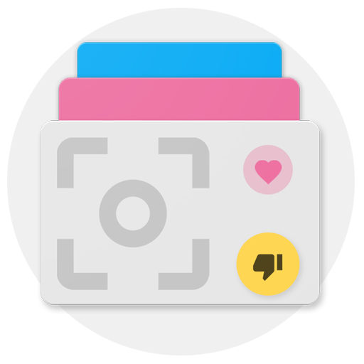

## Capstone-Project : Feddup

  
> Udacity Capstone Project for Android Nanodegree

### Feddup

An Android Application for fed up people wanting to browse, dislike or read anonymous picture articles.

### Screenshots

### Author
[@iamareebjamal](https://github.com/iamareebjamal)
